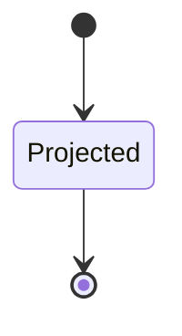
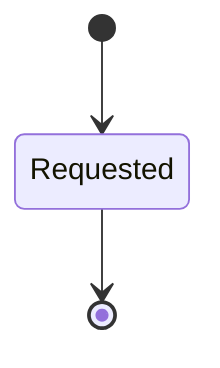
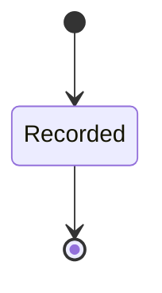
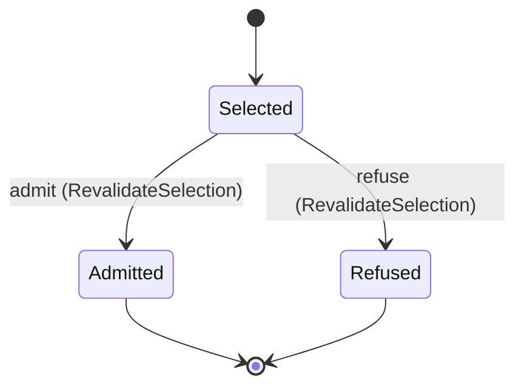
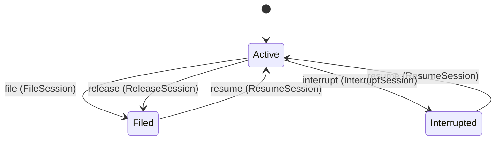
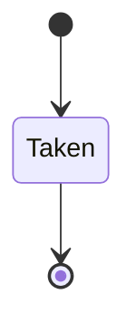

---
# generated by loom-docs, do not edit
title: "Run domain"
sidebar_label: "Run"
description: "ESS reference for the Run domain, generated from the specification."
custom_edit_url: null
---

<!-- generated by loom-docs, do not edit -->

# Run

One model session executing a commission's run. Each catalogue is projected from one frontier; a selection names one action from that catalogue; arguments are generated for the selected action only. Loom never decides authority or completion.

`loom.run` is one of loom's bounded contexts. [All domains](./index.mdx).

## Types

### `ArgumentRequestId`

`loom.run.ArgumentRequestId` wraps `Uuid` and is not interchangeable with one: the whole value of naming it separately is the crossings the model then refuses.

### `CatalogueEntry`

`loom.run.CatalogueEntry` is a record of two fields:

- `action` — `String`
- `status` — `loom.run.CatalogueEntryStatus`

### `CatalogueEntryStatus`

`loom.run.CatalogueEntryStatus` is one of `Admissible` and `ApprovalRequired`.

### `CatalogueId`

`loom.run.CatalogueId` wraps `Uuid` and is not interchangeable with one: the whole value of naming it separately is the crossings the model then refuses.

### `CommissionRunId`

`loom.run.CommissionRunId` wraps `Uuid` and is not interchangeable with one: the whole value of naming it separately is the crossings the model then refuses.

### `CompactionId`

`loom.run.CompactionId` wraps `Uuid` and is not interchangeable with one: the whole value of naming it separately is the crossings the model then refuses.

### `CredentialKind`

`loom.run.CredentialKind` is one of `ApiKey` and `Oauth`.

### `CredentialReference`

`loom.run.CredentialReference` wraps `String` and is not interchangeable with one: the whole value of naming it separately is the crossings the model then refuses.

### `LoopStop`

`loom.run.LoopStop` is one of 12 shapes, told apart by a `kind` field — tagged, so a decoder never has to guess which branch it is reading:

- `awaiting-approval` — `loom.run.LoopStopAwaitingApproval`
- `budget-unobservable` — `loom.run.LoopStopBudgetUnobservable`
- `cancelled` — `loom.run.LoopStopCancelled`
- `completed` — carries nothing; its value is the tag alone
- `context-above-trigger` — `loom.run.LoopStopContextAboveTrigger`
- `deadline` — `loom.run.LoopStopDeadline`
- `max-cost` — `loom.run.LoopStopMaxCost`
- `max-input-tokens` — `loom.run.LoopStopMaxInputTokens`
- `max-output-tokens` — `loom.run.LoopStopMaxOutputTokens`
- `max-turns` — `loom.run.LoopStopMaxTurns`
- `provider-incomplete` — `loom.run.LoopStopProviderIncomplete`
- `unstructured` — `loom.run.LoopStopUnstructured`

### `LoopStopAwaitingApproval`

`loom.run.LoopStopAwaitingApproval` is a record of one field:

- `checkpoint_id` — `String`

### `LoopStopBudgetUnobservable`

`loom.run.LoopStopBudgetUnobservable` is a record of two fields:

- `name` — `String`
- `reason` — `String`

### `LoopStopCancelled`

`loom.run.LoopStopCancelled` is a record of one field:

- `reason` — `String`

### `LoopStopContextAboveTrigger`

`loom.run.LoopStopContextAboveTrigger` is a record of three fields:

- `window` — `Integer`
- `target` — `Integer`
- `occupied` — `Integer`

### `LoopStopDeadline`

`loom.run.LoopStopDeadline` is a record of one field:

- `limit_ms` — `Integer`

### `LoopStopMaxCost`

`loom.run.LoopStopMaxCost` is a record of two fields:

- `limit_micro_usd` — `Integer`
- `spent_micro_usd` — `Integer`

### `LoopStopMaxInputTokens`

`loom.run.LoopStopMaxInputTokens` is a record of two fields:

- `limit` — `Integer`
- `reported` — `Integer`

### `LoopStopMaxOutputTokens`

`loom.run.LoopStopMaxOutputTokens` is a record of two fields:

- `limit` — `Integer`
- `reported` — `Integer`

### `LoopStopMaxTurns`

`loom.run.LoopStopMaxTurns` is a record of one field:

- `limit` — `Integer`

### `LoopStopProviderIncomplete`

`loom.run.LoopStopProviderIncomplete` is a record of one field:

- `reason` — `String`

### `LoopStopUnstructured`

`loom.run.LoopStopUnstructured` is a record of one field:

- `asked_again` — `Integer`

### `ReportedUsage`

`loom.run.ReportedUsage` is a record of five fields:

- `model` — `String`
- `input_tokens` — `Integer`
- `output_tokens` — `Integer`
- `cached_input_tokens` — `Integer`
- `cache_creation_input_tokens` — `Optional<Integer>`, which may be absent

### `RunEnding`

`loom.run.RunEnding` is one of `Answered`, `Stopped` and `Failed`.

### `SelectionId`

`loom.run.SelectionId` wraps `Uuid` and is not interchangeable with one: the whole value of naming it separately is the crossings the model then refuses.

### `SelectionStrategy`

`loom.run.SelectionStrategy` is one of `ReasoningModel`, `FastTyped`, `Rule` and `Hybrid`.

### `SessionId`

`loom.run.SessionId` wraps `Uuid` and is not interchangeable with one: the whole value of naming it separately is the crossings the model then refuses.

### `TurnId`

`loom.run.TurnId` wraps `Uuid` and is not interchangeable with one: the whole value of naming it separately is the crossings the model then refuses.

### `WireCredential`

`loom.run.WireCredential` is a record of two fields:

- `reference` — `loom.run.CredentialReference`
- `kind` — `loom.run.CredentialKind`

Two of the types above are reached by nothing else in this system: `loom.run.LoopStop` and `loom.run.WireCredential`. No entity, view, command, event, error or crossing names them, so it is either vocabulary something outside this specification uses or a leftover — and only a person can tell which.

## Entities

An entity is what this context is about: something with an identity that outlives any one request, a shape, and a lifecycle. The lifecycle is exhaustive — a move that is not drawn below is a move this specification does not permit, and that is the only way it says so. Every move is labelled with the command that takes it, because a move nothing can trigger is refused rather than drawn.

### `ActionCatalogue`

`loom.run.ActionCatalogue`.

An instance is identified by `catalogue_id`, a `loom.run.CatalogueId`. The name is part of the model and not a convention: a view projects the identity under that name, so a projection inventing its own would disagree with the view.

It holds:

- `turn_id` — `loom.run.TurnId`
- `frontier` — `String`
- `case_revision` — `Integer`
- `entries` — `List<loom.run.CatalogueEntry>`

Its `turn_id` is what [`Turn`](#turn) owns it by, as `catalogue`.

No invariant is declared, so nothing here constrains an instance at rest.

Its state is a `loom.run.ActionCatalogue.State`, one of `Projected`. That enum is synthesised from the lifecycle rather than declared beside it, so the states a view's filter compares and the states drawn below cannot disagree.

An instance is created in `Projected`. `Projected` is terminal, so an instance may rest there forever. That is declared rather than inferred from having no way out: an entity that cannot leave a state is either finished or stuck, and only its author knows which.

It declares no moves, so nothing changes its state once it exists.

It has one state, so there is no move to permit or to forbid.

One view projects it: [`Catalogues`](#catalogues).

### `ArgumentRequest`

`loom.run.ArgumentRequest`.

An instance is identified by `argument_request_id`, a `loom.run.ArgumentRequestId`. The name is part of the model and not a convention: a view projects the identity under that name, so a projection inventing its own would disagree with the view.

It holds:

- `selection_id` — `loom.run.SelectionId`

It references at most one [`Selection`](#selection), as `selection`, carried by `ArgumentRequest.selection_id`.

No invariant is declared, so nothing here constrains an instance at rest.

Its state is a `loom.run.ArgumentRequest.State`, one of `Requested`. That enum is synthesised from the lifecycle rather than declared beside it, so the states a view's filter compares and the states drawn below cannot disagree.

An instance is created in `Requested`. `Requested` is terminal, so an instance may rest there forever. That is declared rather than inferred from having no way out: an entity that cannot leave a state is either finished or stuck, and only its author knows which.

It declares no moves, so nothing changes its state once it exists.

It has one state, so there is no move to permit or to forbid.

No view projects it, so nothing outside this context is promised a way to observe one.

### `Compaction`

`loom.run.Compaction`.

An instance is identified by `compaction_id`, a `loom.run.CompactionId`. The name is part of the model and not a convention: a view projects the identity under that name, so a projection inventing its own would disagree with the view.

It holds:

- `session_id` — `loom.run.SessionId`
- `usage` — `Optional<loom.run.ReportedUsage>`, which may be absent

Its `session_id` is what [`Session`](#session) owns it by, as `compactions`.

No invariant is declared, so nothing here constrains an instance at rest.

Its state is a `loom.run.Compaction.State`, one of `Recorded`. That enum is synthesised from the lifecycle rather than declared beside it, so the states a view's filter compares and the states drawn below cannot disagree.

An instance is created in `Recorded`. `Recorded` is terminal, so an instance may rest there forever. That is declared rather than inferred from having no way out: an entity that cannot leave a state is either finished or stuck, and only its author knows which.

It declares no moves, so nothing changes its state once it exists.

It has one state, so there is no move to permit or to forbid.

No view projects it, so nothing outside this context is promised a way to observe one.

### `Selection`

`loom.run.Selection`.

An instance is identified by `selection_id`, a `loom.run.SelectionId`. The name is part of the model and not a convention: a view projects the identity under that name, so a projection inventing its own would disagree with the view.

It holds:

- `catalogue_id` — `loom.run.CatalogueId`
- `action` — `String`
- `confidence` — `Optional<Decimal>`, which may be absent
- `strategy` — `loom.run.SelectionStrategy`
- `case_revision` — `Integer`

It references at most one [`ActionCatalogue`](#actioncatalogue), as `catalogue`, carried by `Selection.catalogue_id`.

No invariant is declared, so nothing here constrains an instance at rest.

Its state is a `loom.run.Selection.State`, one of `Admitted`, `Refused` and `Selected`. That enum is synthesised from the lifecycle rather than declared beside it, so the states a view's filter compares and the states drawn below cannot disagree.

An instance is created in `Selected`. `Admitted` and `Refused` are terminal, so an instance may rest there forever. That is declared rather than inferred from having no way out: an entity that cannot leave a state is either finished or stuck, and only its author knows which.

Each move is taken by a declared command outcome, and a move nothing takes is refused as `missing_causation` rather than left as a state change nobody can trigger:

- `admit` — taken by `loom.run.RevalidateSelection` on its `admitted` outcome
- `refuse` — taken by `loom.run.RevalidateSelection` on its `stale-revision` outcome and `loom.run.RevalidateSelection` on its `not-in-frontier` outcome

An instance is brought into existence by `loom.run.SelectAction` on its `selected` outcome.

Illegal transitions are illegal by absence: no rule forbids them, there is simply no arrow, because a rule would be a second place for the same truth to live. A diagram cannot show an absence, so the pairs it does not connect are listed here, derived from the same transitions — anything named below is a move this specification does not permit.

- `Admitted` may not become `Refused`
- `Admitted` may not become `Selected`
- `Refused` may not become `Admitted`
- `Refused` may not become `Selected`

One view projects it: [`Selections`](#selections).

### `Session`

`loom.run.Session`.

An instance is identified by `session_id`, a `loom.run.SessionId`. The name is part of the model and not a convention: a view projects the identity under that name, so a projection inventing its own would disagree with the view.

It holds:

- `commission_run` — `loom.run.CommissionRunId`
- `wire` — `String`

It owns any number of [`Turn`](#turn), as `turns`, carried by `Turn.session_id`. It owns any number of [`Compaction`](#compaction), as `compactions`, carried by `Compaction.session_id`.

No invariant is declared, so nothing here constrains an instance at rest.

Its state is a `loom.run.Session.State`, one of `Active`, `Filed` and `Interrupted`. That enum is synthesised from the lifecycle rather than declared beside it, so the states a view's filter compares and the states drawn below cannot disagree.

An instance is created in `Active`. No state is terminal: nothing in this lifecycle says an instance may stop moving.

Each move is taken by a declared command outcome, and a move nothing takes is refused as `missing_causation` rather than left as a state change nobody can trigger:

- `file` — taken by `loom.run.FileSession` on its `filed` outcome
- `resume` — taken by `loom.run.ResumeSession` on its `resumed` outcome
- `release` — taken by `loom.run.ReleaseSession` on its `released` outcome
- `interrupt` — taken by `loom.run.InterruptSession` on its `interrupted` outcome

An instance is brought into existence by `loom.run.OpenSession` on its `opened` outcome.

Illegal transitions are illegal by absence: no rule forbids them, there is simply no arrow, because a rule would be a second place for the same truth to live. A diagram cannot show an absence, so the pairs it does not connect are listed here, derived from the same transitions — anything named below is a move this specification does not permit.

- `Filed` may not become `Interrupted`
- `Interrupted` may not become `Filed`

One view projects it: [`Sessions`](#sessions).

### `Turn`

`loom.run.Turn`.

An instance is identified by `turn_id`, a `loom.run.TurnId`. The name is part of the model and not a convention: a view projects the identity under that name, so a projection inventing its own would disagree with the view.

It holds:

- `session_id` — `loom.run.SessionId`
- `index` — `Integer`
- `items` — `List<String>`

It owns at most one [`ActionCatalogue`](#actioncatalogue), as `catalogue`, carried by `ActionCatalogue.turn_id`. Its `session_id` is what [`Session`](#session) owns it by, as `turns`.

No invariant is declared, so nothing here constrains an instance at rest.

Its state is a `loom.run.Turn.State`, one of `Taken`. That enum is synthesised from the lifecycle rather than declared beside it, so the states a view's filter compares and the states drawn below cannot disagree.

An instance is created in `Taken`. `Taken` is terminal, so an instance may rest there forever. That is declared rather than inferred from having no way out: an entity that cannot leave a state is either finished or stuck, and only its author knows which.

It declares no moves, so nothing changes its state once it exists.

It has one state, so there is no move to permit or to forbid.

No view projects it, so nothing outside this context is promised a way to observe one.

## Views

A view is what the outside world is promised it can observe. Each one says which instances it contains and how soon it reflects a command that has already returned, because "you can read this" without "how soon" is the promise every flaky suite is built on.

### `Catalogues`

`loom.run.Catalogues`.

It reads [`ActionCatalogue`](#actioncatalogue).

It contains every instance of that entity: no filter narrows it, which is a decision somebody made and not a line somebody omitted.

It exposes:

- `catalogue_id` — `loom.run.CatalogueId`
- `case_revision` — `Integer`
- `state` — `loom.run.ActionCatalogue.State`

It declares no order, so the rows come back in whatever order the implementation has, and two reads may disagree.

**Read-your-writes**: it is current the moment the command that changed it returns. A caller that has just created an invoice and cannot see it in here has been told a lie about what it did.

A generated scenario asserts it once, immediately after the command: a view promising this and not keeping the promise has to fail the suite rather than be retried until it passes.

### `Selections`

`loom.run.Selections`.

It reads [`Selection`](#selection).

It contains every instance of that entity: no filter narrows it, which is a decision somebody made and not a line somebody omitted.

It exposes:

- `selection_id` — `loom.run.SelectionId`
- `catalogue_id` — `loom.run.CatalogueId`
- `action` — `String`
- `strategy` — `loom.run.SelectionStrategy`
- `case_revision` — `Integer`
- `state` — `loom.run.Selection.State`

It declares no order, so the rows come back in whatever order the implementation has, and two reads may disagree.

**Read-your-writes**: it is current the moment the command that changed it returns. A caller that has just created an invoice and cannot see it in here has been told a lie about what it did.

A generated scenario asserts it once, immediately after the command: a view promising this and not keeping the promise has to fail the suite rather than be retried until it passes.

### `Sessions`

`loom.run.Sessions`.

It reads [`Session`](#session).

It contains every instance of that entity: no filter narrows it, which is a decision somebody made and not a line somebody omitted.

It exposes:

- `session_id` — `loom.run.SessionId`
- `commission_run` — `loom.run.CommissionRunId`
- `wire` — `String`
- `state` — `loom.run.Session.State`

It declares no order, so the rows come back in whatever order the implementation has, and two reads may disagree.

**Read-your-writes**: it is current the moment the command that changed it returns. A caller that has just created an invoice and cannot see it in here has been told a lie about what it did.

A generated scenario asserts it once, immediately after the command: a view promising this and not keeping the promise has to fail the suite rather than be retried until it passes.

## Commands

### `FileSession`

`loom.run.FileSession`.

It takes:

- `session_id` — `loom.run.SessionId`
- `ending` — `loom.run.RunEnding`

It has two outcomes.

**`filed`** — The default branch, taken when no other outcome's condition matched. It moves a `loom.run.Session` from `Active` to `Filed`, along the declared move `file`. The instance is the one named by the input field `session_id`. It emits `loom.run.SessionFiled`. A test reaches it by constructing an input that satisfies no other outcome's condition.

**`wrong-state`** — Taken when the subject is resting in a state none of this command's moves start from — a `loom.run.Session` in `Filed` and `Interrupted`, which is what is left of the lifecycle once this command's own moves are taken away. The document lists none of it. No entity in this specification changes. It reports `loom.run.SessionStateConflict`, carrying `state`. It emits nothing. A test reaches it by driving an instance into one of those states and then issuing the command, because no input selects this branch.

### `InterruptSession`

`loom.run.InterruptSession`.

It takes:

- `session_id` — `loom.run.SessionId`

It has two outcomes.

**`interrupted`** — The default branch, taken when no other outcome's condition matched. It moves a `loom.run.Session` from `Active` to `Interrupted`, along the declared move `interrupt`. The instance is the one named by the input field `session_id`. It emits `loom.run.SessionInterrupted`. A test reaches it by constructing an input that satisfies no other outcome's condition.

**`wrong-state`** — Taken when the subject is resting in a state none of this command's moves start from — a `loom.run.Session` in `Filed` and `Interrupted`, which is what is left of the lifecycle once this command's own moves are taken away. The document lists none of it. No entity in this specification changes. It reports `loom.run.SessionStateConflict`, carrying `state`. It emits nothing. A test reaches it by driving an instance into one of those states and then issuing the command, because no input selects this branch.

### `OpenSession`

`loom.run.OpenSession`.

It takes:

- `session_id` — `loom.run.SessionId`
- `commission_run` — `loom.run.CommissionRunId`
- `wire` — `String`

It has two outcomes.

**`session-exists`** — Taken when a record already carries the identity the command's creating branch would create, and no input-guarded refusal applies. No entity in this specification changes. It reports `loom.run.SessionExists`, carrying `session_id`. It emits nothing. A test reaches it by sending the command twice with one identity: the first call creates the record, the second is answered by this branch.

**`opened`** — The default branch, taken when no other outcome's condition matched. It creates a `loom.run.Session`, which starts in `Active`. The new instance's identity is published as `session_id` on `loom.run.SessionOpened`. It emits `loom.run.SessionOpened`. It sets `commission_run` from `input.commission_run` and `wire` from `input.wire`. A test reaches it by constructing an input that satisfies no other outcome's condition.

### `ProjectCatalogue`

`loom.run.ProjectCatalogue`.

It takes:

- `catalogue_id` — `loom.run.CatalogueId`
- `turn_id` — `loom.run.TurnId`
- `frontier` — `String`
- `case_revision` — `Integer`
- `entries` — `List<loom.run.CatalogueEntry>`

It has two outcomes.

**`catalogue-exists`** — Taken when a record already carries the identity the command's creating branch would create, and no input-guarded refusal applies. No entity in this specification changes. It reports `loom.run.CatalogueExists`, carrying `catalogue_id`. It emits nothing. A test reaches it by sending the command twice with one identity: the first call creates the record, the second is answered by this branch.

**`projected`** — The default branch, taken when no other outcome's condition matched. It creates a `loom.run.ActionCatalogue`, which starts in `Projected`. The new instance's identity is published as `catalogue_id` on `loom.run.CatalogueProjected`. It emits `loom.run.CatalogueProjected`. It sets `turn_id` from `input.turn_id`, `frontier` from `input.frontier`, `case_revision` from `input.case_revision` and `entries` from `input.entries`. A test reaches it by constructing an input that satisfies no other outcome's condition.

### `RecordCompaction`

`loom.run.RecordCompaction`.

It takes:

- `compaction_id` — `loom.run.CompactionId`
- `session_id` — `loom.run.SessionId`
- `usage` — `Optional<loom.run.ReportedUsage>`, which may be absent

It has three outcomes.

**`session-unknown`** — Taken when no `loom.run.Session` carries the identity `input.session_id` names. No entity in this specification changes. It reports `loom.run.SessionNotFound`, carrying `session_id`. It emits nothing. A test reaches it by arranging the row of the other entity the input names, or its absence, and sending the command for it.

**`session-not-active`** — Taken when the `loom.run.Session` that `input.session_id` names exists and its stored fields satisfy `state != Active`. No entity in this specification changes. It reports `loom.run.SessionNotActive`, carrying `session_id`. It emits nothing. A test reaches it by arranging the row of the other entity the input names, or its absence, and sending the command for it.

**`recorded`** — The default branch, taken when no other outcome's condition matched. It creates a `loom.run.Compaction`, which starts in `Recorded`. The new instance's identity is published as `compaction_id` on `loom.run.SessionCompacted`. It emits `loom.run.SessionCompacted`. It sets `session_id` from `input.session_id` and `usage` from `input.usage`. A test reaches it by constructing an input that satisfies no other outcome's condition.

### `RecordTurn`

`loom.run.RecordTurn`.

It takes:

- `turn_id` — `loom.run.TurnId`
- `session_id` — `loom.run.SessionId`
- `index` — `Integer`
- `items` — `List<String>`

It has three outcomes.

**`session-unknown`** — Taken when no `loom.run.Session` carries the identity `input.session_id` names. No entity in this specification changes. It reports `loom.run.SessionNotFound`, carrying `session_id`. It emits nothing. A test reaches it by arranging the row of the other entity the input names, or its absence, and sending the command for it.

**`session-not-active`** — Taken when the `loom.run.Session` that `input.session_id` names exists and its stored fields satisfy `state != Active`. No entity in this specification changes. It reports `loom.run.SessionNotActive`, carrying `session_id`. It emits nothing. A test reaches it by arranging the row of the other entity the input names, or its absence, and sending the command for it.

**`recorded`** — The default branch, taken when no other outcome's condition matched. It creates a `loom.run.Turn`, which starts in `Taken`. The new instance's identity is published as `turn_id` on `loom.run.TurnRecorded`. It emits `loom.run.TurnRecorded`. It sets `session_id` from `input.session_id`, `index` from `input.index` and `items` from `input.items`. A test reaches it by constructing an input that satisfies no other outcome's condition.

### `ReleaseSession`

`loom.run.ReleaseSession`.

It takes:

- `session_id` — `loom.run.SessionId`

It has two outcomes.

**`released`** — The default branch, taken when no other outcome's condition matched. It moves a `loom.run.Session` from `Active` to `Filed`, along the declared move `release`. The instance is the one named by the input field `session_id`. It emits `loom.run.SessionReleased`. A test reaches it by constructing an input that satisfies no other outcome's condition.

**`wrong-state`** — Taken when the subject is resting in a state none of this command's moves start from — a `loom.run.Session` in `Filed` and `Interrupted`, which is what is left of the lifecycle once this command's own moves are taken away. The document lists none of it. No entity in this specification changes. It reports `loom.run.SessionStateConflict`, carrying `state`. It emits nothing. A test reaches it by driving an instance into one of those states and then issuing the command, because no input selects this branch.

### `RequestArguments`

`loom.run.RequestArguments`.

It takes:

- `argument_request_id` — `loom.run.ArgumentRequestId`
- `selection_id` — `loom.run.SelectionId`

It has three outcomes.

**`selection-unknown`** — Taken when no `loom.run.Selection` carries the identity `input.selection_id` names. No entity in this specification changes. It reports `loom.run.SelectionNotFound`, carrying `selection_id`. It emits nothing. A test reaches it by arranging the row of the other entity the input names, or its absence, and sending the command for it.

**`selection-not-selected`** — Taken when the `loom.run.Selection` that `input.selection_id` names exists and its stored fields satisfy `state != Selected`. No entity in this specification changes. It reports `loom.run.SelectionNotSelected`, carrying `selection_id`. It emits nothing. A test reaches it by arranging the row of the other entity the input names, or its absence, and sending the command for it.

**`requested`** — The default branch, taken when no other outcome's condition matched. It creates a `loom.run.ArgumentRequest`, which starts in `Requested`. The new instance's identity is published as `argument_request_id` on `loom.run.ArgumentsRequested`. It emits `loom.run.ArgumentsRequested`. It sets `selection_id` from `input.selection_id`. A test reaches it by constructing an input that satisfies no other outcome's condition.

### `ResumeSession`

`loom.run.ResumeSession`.

It takes:

- `session_id` — `loom.run.SessionId`
- `wire` — `String`

It has three outcomes.

**`cross-wire`** — Taken when the existing subject's stored fields satisfy `wire != input.wire`. No entity in this specification changes. It reports `loom.run.SessionWireMismatch`, carrying `session_id`, `session_wire` and `wire`. It emits nothing. A test establishes and independently observes the subject enum fact before selecting this branch.

**`resumed`** — The default branch, taken when no other outcome's condition matched. It moves a `loom.run.Session` from `Filed` and `Interrupted` to `Active`, along the declared move `resume`. The instance is the one named by the input field `session_id`. It emits `loom.run.SessionResumed`. A test reaches it by constructing an input that satisfies no other outcome's condition.

**`wrong-state`** — Taken when the subject is resting in a state none of this command's moves start from — a `loom.run.Session` in `Active`, which is what is left of the lifecycle once this command's own moves are taken away. The document lists none of it. No entity in this specification changes. It reports `loom.run.SessionStateConflict`, carrying `state`. It emits nothing. A test reaches it by driving an instance into one of those states and then issuing the command, because no input selects this branch.

### `RevalidateSelection`

`loom.run.RevalidateSelection`.

It takes:

- `selection_id` — `loom.run.SelectionId`
- `case_revision` — `Integer`
- `frontier_actions` — `List<String>`

It has four outcomes.

**`stale-revision`** — Taken when the existing subject's stored fields satisfy `case_revision != input.case_revision`. It moves a `loom.run.Selection` from `Selected` to `Refused`, along the declared move `refuse`. The instance is the one named by the input field `selection_id`. It emits `loom.run.SelectionStale`. A test establishes and independently observes the subject enum fact before selecting this branch.

**`not-in-frontier`** — Decided outside the input: the frontier action ids in the input do not list the selection's action. No predicate over the input reaches this branch, and saying `when: false` instead would have claimed it is unreachable, which is a different and false statement. It moves a `loom.run.Selection` from `Selected` to `Refused`, along the declared move `refuse`. The instance is the one named by the input field `selection_id`. It emits `loom.run.SelectionNotInFrontier`. A test reaches it by injecting the declared fault, because no input can.

**`admitted`** — The default branch, taken when no other outcome's condition matched. It moves a `loom.run.Selection` from `Selected` to `Admitted`, along the declared move `admit`. The instance is the one named by the input field `selection_id`. It emits `loom.run.SelectionAdmitted`. A test reaches it by constructing an input that satisfies no other outcome's condition.

**`wrong-state`** — Taken when the subject is resting in a state none of this command's moves start from — a `loom.run.Selection` in `Admitted` and `Refused`, which is what is left of the lifecycle once this command's own moves are taken away. The document lists none of it. No entity in this specification changes. It reports `loom.run.SelectionStateConflict`, carrying `state`. It emits nothing. A test reaches it by driving an instance into one of those states and then issuing the command, because no input selects this branch.

### `SelectAction`

`loom.run.SelectAction`.

It takes:

- `selection_id` — `loom.run.SelectionId`
- `catalogue_id` — `loom.run.CatalogueId`
- `action` — `String`
- `confidence` — `Optional<Decimal>`, which may be absent
- `strategy` — `loom.run.SelectionStrategy`
- `case_revision` — `Integer`

It has four outcomes.

**`catalogue-unknown`** — Taken when no `loom.run.ActionCatalogue` carries the identity `input.catalogue_id` names. No entity in this specification changes. It reports `loom.run.CatalogueNotFound`, carrying `catalogue_id`. It emits nothing. A test reaches it by arranging the row of the other entity the input names, or its absence, and sending the command for it.

**`not-in-catalogue`** — Taken when the `loom.run.ActionCatalogue` that `input.catalogue_id` names exists and its stored fields satisfy `not (exists entry in entries: (entry.action == input.action))`. No entity in this specification changes. It reports `loom.run.ActionNotInCatalogue`, carrying `action`. It emits nothing. A test reaches it by arranging the row of the other entity the input names, or its absence, and sending the command for it.

**`revision-mismatch`** — Taken when the `loom.run.ActionCatalogue` that `input.catalogue_id` names exists and its stored fields satisfy `case_revision != input.case_revision`. No entity in this specification changes. It reports `loom.run.CatalogueRevisionMismatch`, carrying `catalogue_id`, `case_revision` and `catalogue_revision`. It emits nothing. A test reaches it by arranging the row of the other entity the input names, or its absence, and sending the command for it.

**`selected`** — The default branch, taken when no other outcome's condition matched. It creates a `loom.run.Selection`, which starts in `Selected`. The new instance's identity is published as `selection_id` on `loom.run.ActionSelected`. It emits `loom.run.ActionSelected`. It sets `catalogue_id` from `input.catalogue_id`, `action` from `input.action`, `confidence` from `input.confidence`, `strategy` from `input.strategy` and `case_revision` from `input.case_revision`. A test reaches it by constructing an input that satisfies no other outcome's condition.

## Events

### `ActionSelected`

`loom.run.ActionSelected`.

It carries:

- `selection_id` — `loom.run.SelectionId`
- `catalogue_id` — `loom.run.CatalogueId`
- `action` — `String`

Emitted by `loom.run.SelectAction` on its `selected` outcome.

Nothing in this system reacts to it.

### `ArgumentsRequested`

`loom.run.ArgumentsRequested`.

It carries:

- `argument_request_id` — `loom.run.ArgumentRequestId`
- `selection_id` — `loom.run.SelectionId`

Emitted by `loom.run.RequestArguments` on its `requested` outcome.

Nothing in this system reacts to it.

### `CatalogueProjected`

`loom.run.CatalogueProjected`.

It carries:

- `catalogue_id` — `loom.run.CatalogueId`
- `turn_id` — `loom.run.TurnId`
- `case_revision` — `Integer`

Emitted by `loom.run.ProjectCatalogue` on its `projected` outcome.

Nothing in this system reacts to it.

### `SelectionAdmitted`

`loom.run.SelectionAdmitted`.

It carries:

- `selection_id` — `loom.run.SelectionId`

Emitted by `loom.run.RevalidateSelection` on its `admitted` outcome.

Nothing in this system reacts to it.

### `SelectionNotInFrontier`

`loom.run.SelectionNotInFrontier`.

It carries:

- `selection_id` — `loom.run.SelectionId`
- `action` — `String`

Emitted by `loom.run.RevalidateSelection` on its `not-in-frontier` outcome.

Nothing in this system reacts to it.

### `SelectionStale`

`loom.run.SelectionStale`.

It carries:

- `selection_id` — `loom.run.SelectionId`
- `catalogue_revision` — `Integer`
- `case_revision` — `Integer`

Emitted by `loom.run.RevalidateSelection` on its `stale-revision` outcome.

Nothing in this system reacts to it.

### `SessionCompacted`

`loom.run.SessionCompacted`.

It carries:

- `compaction_id` — `loom.run.CompactionId`
- `session_id` — `loom.run.SessionId`
- `usage` — `Optional<loom.run.ReportedUsage>`, which may be absent

Emitted by `loom.run.RecordCompaction` on its `recorded` outcome.

Nothing in this system reacts to it.

### `SessionFiled`

`loom.run.SessionFiled`.

It carries:

- `session_id` — `loom.run.SessionId`
- `ending` — `loom.run.RunEnding`

Emitted by `loom.run.FileSession` on its `filed` outcome.

Nothing in this system reacts to it.

### `SessionInterrupted`

`loom.run.SessionInterrupted`.

It carries:

- `session_id` — `loom.run.SessionId`

Emitted by `loom.run.InterruptSession` on its `interrupted` outcome.

Nothing in this system reacts to it.

### `SessionOpened`

`loom.run.SessionOpened`.

It carries:

- `session_id` — `loom.run.SessionId`
- `commission_run` — `loom.run.CommissionRunId`
- `wire` — `String`

Emitted by `loom.run.OpenSession` on its `opened` outcome.

Nothing in this system reacts to it.

### `SessionReleased`

`loom.run.SessionReleased`.

It carries:

- `session_id` — `loom.run.SessionId`
- `ending` — `loom.run.RunEnding`

Emitted by `loom.run.ReleaseSession` on its `released` outcome.

Nothing in this system reacts to it.

### `SessionResumed`

`loom.run.SessionResumed`.

It carries:

- `session_id` — `loom.run.SessionId`
- `wire` — `String`

Emitted by `loom.run.ResumeSession` on its `resumed` outcome.

Nothing in this system reacts to it.

### `TurnRecorded`

`loom.run.TurnRecorded`.

It carries:

- `turn_id` — `loom.run.TurnId`
- `session_id` — `loom.run.SessionId`
- `index` — `Integer`

Emitted by `loom.run.RecordTurn` on its `recorded` outcome.

Nothing in this system reacts to it.

## Errors

### `ActionNotInCatalogue`

It carries:

- `action` — `String`

Reported by `loom.run.SelectAction` on its `not-in-catalogue` outcome.

### `CatalogueExists`

It carries:

- `catalogue_id` — `loom.run.CatalogueId`

Reported by `loom.run.ProjectCatalogue` on its `catalogue-exists` outcome.

### `CatalogueNotFound`

It carries:

- `catalogue_id` — `loom.run.CatalogueId`

Reported by `loom.run.SelectAction` on its `catalogue-unknown` outcome.

### `CatalogueRevisionMismatch`

It carries:

- `catalogue_id` — `loom.run.CatalogueId`
- `case_revision` — `Integer`
- `catalogue_revision` — `Integer`

Reported by `loom.run.SelectAction` on its `revision-mismatch` outcome.

### `SelectionNotFound`

It carries:

- `selection_id` — `loom.run.SelectionId`

Reported by `loom.run.RequestArguments` on its `selection-unknown` outcome.

### `SelectionNotSelected`

It carries:

- `selection_id` — `loom.run.SelectionId`

Reported by `loom.run.RequestArguments` on its `selection-not-selected` outcome.

### `SelectionStateConflict`

It carries:

- `state` — `loom.run.Selection.State`

Reported by `loom.run.RevalidateSelection` on its `wrong-state` outcome.

### `SessionExists`

It carries:

- `session_id` — `loom.run.SessionId`

Reported by `loom.run.OpenSession` on its `session-exists` outcome.

### `SessionNotActive`

It carries:

- `session_id` — `loom.run.SessionId`

Reported by `loom.run.RecordCompaction` on its `session-not-active` outcome.

Reported by `loom.run.RecordTurn` on its `session-not-active` outcome.

### `SessionNotFound`

It carries:

- `session_id` — `loom.run.SessionId`

Reported by `loom.run.RecordCompaction` on its `session-unknown` outcome.

Reported by `loom.run.RecordTurn` on its `session-unknown` outcome.

### `SessionStateConflict`

It carries:

- `state` — `loom.run.Session.State`

Reported by `loom.run.FileSession` on its `wrong-state` outcome.

Reported by `loom.run.InterruptSession` on its `wrong-state` outcome.

Reported by `loom.run.ReleaseSession` on its `wrong-state` outcome.

Reported by `loom.run.ResumeSession` on its `wrong-state` outcome.

### `SessionWireMismatch`

It carries:

- `session_id` — `loom.run.SessionId`
- `session_wire` — `String`
- `wire` — `String`

Reported by `loom.run.ResumeSession` on its `cross-wire` outcome.

---

Generated from loom v1 · model digest `cee559ad7b98c0f74aa2bb607bd073e52902527033f7f7fd8d1292410f7f2e17` · contract digest `slice-sha256/2:c791376a2e2ad9ce6ecb61095fa39fcff960e2f436017f5f49b528b2c64cf285`. Do not edit this file; change the specification and regenerate it with `task docs-generate`.
